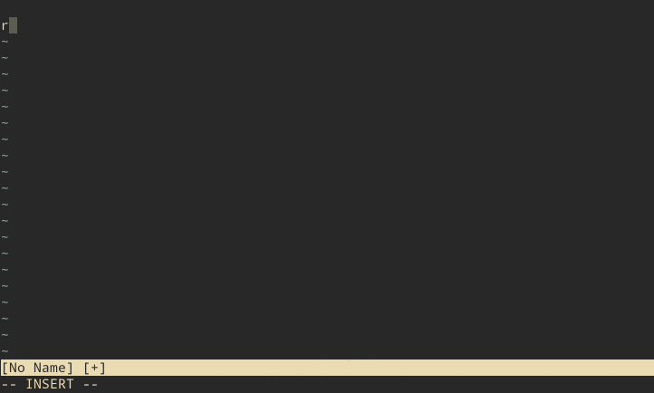

# trimWhitespaces.vim



This plugin does two things:
 - removes tailing whitespaces on file save
 - highlight tailing whitespaces as error

Triming can be enabled/disabled by setting variable
```vimL
   let g:trimWhitespaces = 1 " enable
   let g:trimWhitespaces = 0 " disable
```
